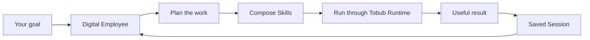

  

<h1 align="center">Tobub</h1>

<strong>AI digital employees that turn goals into finished work.</strong>

  <a href="https://tobub.com">Website</a> ·
  <a href="https://github.com/pow505/tobub/releases/latest">Download Tobub</a> ·
  <a href="readme.zh-CN.md">中文</a>

## What is Tobub?

Tobub is a local-first AI workspace built around **digital employees**. Instead of asking AI for a one-off answer, you give Tobub an outcome. A digital employee understands the goal, breaks it into steps, selects the right automation Skills, keeps the working context, and carries the task through to a usable result.

For example:

> Review today’s market signals and prepare the three actions we should take next.

Tobub can collect sources, filter useful information, compare changes, write a briefing, check the evidence, recommend actions, and save the complete work record for review.

## Why Tobub is different

| | What it means |
| --- | --- |
| **Digital Employees** | AI Agents with a professional role, a goal, a plan, and the ability to carry work through multiple steps. |
| **Automation Skills** | JSON-based capabilities that connect an Agent to platforms and tools — collect, organize, analyze, and execute. |
| **Work Sessions** | A visible record of the plan, progress, sources, result, and context, so work can be reviewed and continued. |

## How automation Skills work

Skills turn external platforms and tools into capabilities an Agent can use. They work in four stages:

1. **Collect** information and data.
2. **Organize** mixed sources into reusable work material.
3. **Analyze** signals, changes, competitors, customers, and markets.
4. **Execute** the next action and return a clear result.

The value is in composition. A Research Analyst can combine Search, Web Crawler, RSS, GitHub, and community Skills into one repeatable market-intelligence workflow instead of making a person move data between isolated tools.

## Digital employee roles

Tobub currently presents these Agent roles:

- Operations Specialist
- Data Engineer
- Research Analyst
- Content Strategist
- Social Media Manager
- Market Intelligence Analyst
- SEO Specialist
- Customer Insights Analyst
- Product Analyst
- News Desk Editor
- Sales Researcher
- Knowledge Curator

Each role turns a professional method into a reusable workflow. The Agent coordinates Skills, retains context, checks progress, and leaves work that a person can inspect and continue.

## Current Skill library

- **Research:** Google Search, Web Crawler, RSS & Feeds, Reddit
- **Social intelligence:** YouTube, Facebook, TikTok, Instagram, X / Twitter
- **Business and market:** LinkedIn, Shopify / Amazon
- **Developer intelligence:** GitHub

These Skills support market research, trend discovery, social listening, customer insight, competitor monitoring, news monitoring, SEO research, and structured web extraction.

## Typical workflow

1. Give Tobub a concrete outcome.
2. The digital employee confirms the goal and creates a work plan.
3. It selects the Skills needed for the task.
4. Skills run through the Tobub Runtime against supported platforms.
5. Tobub keeps the progress, sources, evidence, and intermediate work visible.
6. The Agent delivers the result and saves a Session for follow-up work.

## Open Skills. Closed execution product.

This repository is the open **Skill layer** around Tobub. A Skill is a JSON definition consumed by compatible Tobub software. It is an executable product artifact, not a standalone application.

Cloning this repository alone does **not** provide the Tobub desktop application, Runtime, platform authentication, account management, or complete execution environment.

| Open in this repository | Not included here |
| --- | --- |
| Skill JSON definitions | Tobub desktop application |
| Skill documentation and examples | Tobub Runtime implementation |
| Community review and improvements | Platform adapters and authentication |
| Reusable automation workflows | Desktop installers and commercial distribution |

This boundary is intentional: the community expands Tobub’s capability ecosystem, while Tobub provides the controlled execution workspace and product experience.

## Running a Skill

The intended flow is:

1. Install Tobub for Windows, macOS, or Linux.
2. Import or install a Skill from this repository.
3. Configure the platform account and runtime resources required by that Skill.
4. Run it directly or let a digital employee select it.
5. Review the result and execution history in the Session.

For teams and builders, Tobub also supports Docker/self-hosted deployment, local data control, and OpenAPI integration. Those capabilities belong to the closed Tobub application and Runtime.

## Contributing a Skill

Make every contribution easy to understand and safe to run:

- explain the problem and workflow it improves;
- state the platform, inputs, outputs, side effects, and required permissions;
- include the JSON definition and a realistic example;
- document rate limits, platform restrictions, and failure behavior;
- test it inside compatible Tobub software before opening a pull request;
- never commit credentials, cookies, access tokens, private data, or unauthorized content.

## Compatibility and safety

Skills interact with third-party platforms. Their terms, APIs, rate limits, privacy requirements, robots rules, and local laws still apply. Use test accounts and minimum permissions when validating a Skill. A Skill should fail closed when authentication, required input, or platform state is uncertain.

## Product access

- [Download Tobub](https://github.com/pow505/tobub/releases/latest)
- [Tobub website](https://tobub.com)
- [中文 README](readme.zh-CN.md)

The desktop application is distributed separately from this open Skill repository.
