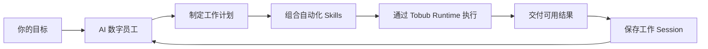

  

<h1 align="center">Tobub</h1>

<strong>让 AI 数字员工，把目标推进成真正完成的工作。</strong>

  <a href="https://tobub.com">官网</a> ·
  <a href="https://github.com/pow505/tobub/releases/latest">下载 Tobub</a> ·
  <a href="readme.md">English</a>

## Tobub 是什么？

Tobub 是一款本地优先的智能自动化平台，用于多平台信息采集、AI 分析和实时监控，帮助用户自动提取数据、发现趋势并执行后续任务。

例如：

> 整理今天的行业动态，并给出接下来最值得采取的三项行动。

Tobub 可以自动收集来源、筛选有效信息、比较变化、生成简报、核对依据、推荐行动，并将完整工作过程保存下来，方便复查和继续推进。

## Tobub 的核心价值

| | 说明 |
| --- | --- |
| **AI 数字员工** | 有专业角色、目标和工作计划，能够跨多个步骤持续完成工作的 Agent。 |
| **自动化 Skills** | 以 JSON 定义的可执行能力，连接平台和工具，负责收集、整理、分析与执行。 |
| **工作 Session** | 保存计划、进度、来源、结果和上下文，让工作过程可查看、可复盘、可继续。 |

## 自动化 Skill 如何工作？

Skill 把外部平台和工具变成 Agent 可以调用的能力，覆盖四个阶段：

1. **Collect / 收集**：采集信息与数据。
2. **Organize / 整理**：把混合来源变成结构化、可复用的工作材料。
3. **Analyze / 分析**：识别信号，比较变化，研究竞品、客户和市场。
4. **Execute / 执行**：完成下一步动作并返回清晰结果。

真正的价值在于组合。一个研究分析师可以把搜索、网页抓取、RSS、GitHub 和社区类 Skills 组合成一套完整的市场情报工作流，而不是让人手动在多个工具之间搬运信息。

## AI 数字员工角色

Tobub 当前展示的 Agent 包括：

- 运营专家
- 数据工程师
- 研究分析师
- 内容策略师
- 社交媒体经理
- 市场情报分析师
- SEO 专家
- 客户洞察分析师
- 产品分析师
- 新闻编辑
- 销售研究员
- 知识策展人

每个角色都把一种专业工作方法变成可复用的工作流。Agent 负责协调 Skills、保留上下文、检查进度，并留下可以审阅和继续推进的成果。

## 当前 Skill 能力库

- **研究类**：Google Search、Web Crawler、RSS & Feeds、Reddit
- **社交情报类**：YouTube、Facebook、TikTok、Instagram、X / Twitter
- **商业与市场类**：LinkedIn、Shopify / Amazon
- **开发者情报类**：GitHub

这些 Skills 可以用于市场研究、趋势发现、社交监听、客户洞察、竞品监控、新闻监测、SEO 研究和结构化网页提取。

## 典型工作流

1. 给 Tobub 一个明确目标。
2. 数字员工确认目标并生成工作计划。
3. Agent 选择任务所需的 Skills。
4. Skills 通过 Tobub Runtime 访问支持的平台并执行。
5. Tobub 展示进度、来源、依据和中间结果。
6. Agent 交付结果，并保存可继续使用的 Session。

## Skill 开源，执行产品闭源

本仓库开放的是 Tobub 的 **Skill 能力层**。Skill 是由兼容 Tobub 的软件读取和执行的 JSON 定义，是可执行的产品工件，不是独立应用。

单独克隆本仓库并不能获得 Tobub 桌面应用、Runtime、平台认证、账号管理或完整执行环境。

| 本仓库开放 | 不包含在本仓库 |
| --- | --- |
| Skill JSON 定义 | Tobub 桌面应用 |
| Skill 文档与示例 | Tobub Runtime 实现 |
| 社区评审与改进 | 平台适配器与认证系统 |
| 可复用自动化工作流 | 安装包及商业发行代码 |

这个边界是有意设计的：社区可以不断扩展 Tobub 的能力生态，而 Tobub 负责提供受控的执行工作区和完整产品体验。

## 如何运行 Skill？

1. 下载 Windows、macOS 或 Linux 版 Tobub。
2. 在 Tobub 中导入或安装本仓库的 Skill。
3. 配置 Skill 所需的平台账号和运行时资源。
4. 手动运行 Skill，或让数字员工自动选择它。
5. 在 Session 中查看执行过程和结果。

团队和开发者还可以使用 Docker / 自部署、数据边界控制与 OpenAPI 集成。这些能力属于闭源的 Tobub 应用与 Runtime。

## 如何贡献 Skill？

每个贡献都应该清楚、安全、容易复用：

- 说明它解决的问题和改善的工作流；
- 写清平台、输入、输出、副作用和所需权限；
- 提供 JSON 定义和真实使用示例；
- 说明速率限制、平台限制和失败处理；
- 在兼容的 Tobub 软件中测试后再提交 Pull Request；
- 不要提交密码、Cookie、Token、个人数据或未经授权的内容。

## 安全与平台合规

Skills 会与第三方平台交互，必须遵守平台条款、API 限制、隐私要求、robots 规则和当地法律。测试时请使用测试账号和最小权限。当认证、输入或平台状态不确定时，Skill 应安全失败。

## 产品入口

- [下载 Tobub](https://github.com/pow505/tobub/releases/latest)
- [Tobub 官网](https://tobub.com)
- [English README](readme.md)

桌面应用与本开放 Skill 仓库分开发布。
